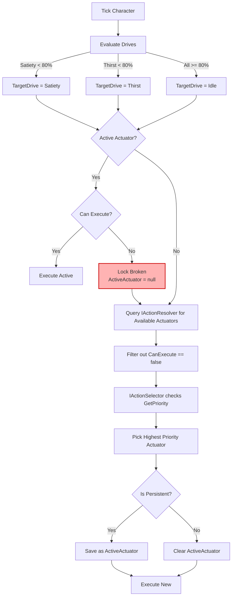
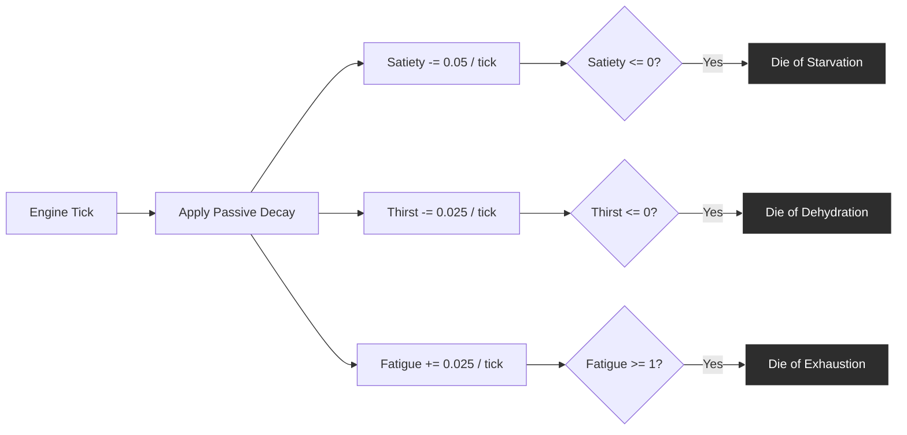
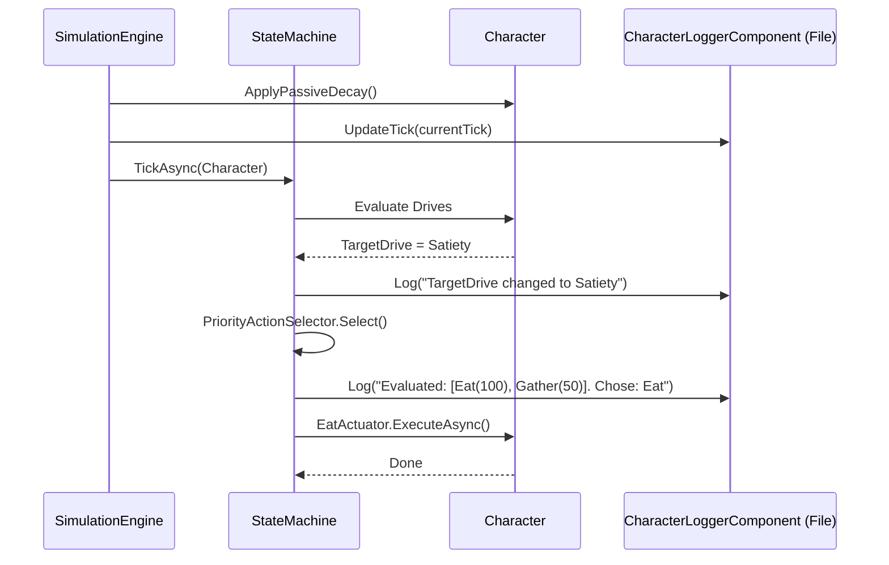

# NPC Architecture & Decision Loop

The NPC Simulation relies on a prioritized state machine driven by biological needs (Drives) and context-aware actions (Actuators).

## Core Action Selection Loop

Below is a diagram of the core decision loop that runs every simulation tick. This diagram highlights the recent fix to the persistence lock, which ensures characters do not starve while gathering food.

### Breaking the Persistence Lock (The Apple Hoarding Bug)
Previously, `GatherFood` was persistent. If a character became hungry, they selected `GatherFood`. Once they had an apple, `GatherFood` remained active and capable of executing, meaning they just kept gathering apples forever until they starved to death. 

To fix this, we updated `GatherFoodActuator.CanExecute()` to return `false` if `TargetDrive == Satiety` AND the character already has an apple. This triggers the **Lock Broken** state in the diagram above, forcing the State Machine to re-evaluate and select the higher priority `EatActuator`.

## Drive Decay System

Drives passively decay over time inside the `SimulationEngine`.

## Per-Character Logging Architecture

A newly introduced `CharacterLoggerComponent` allows individual characters to write out their decision matrices to isolated log files.

