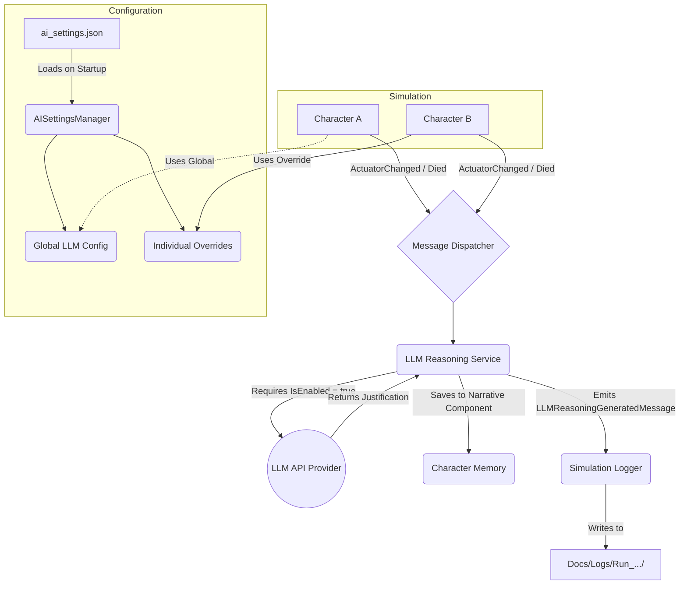

# AI System Architecture

This document provides a visual representation of the Persistent AI Configuration System and how the LLM reasoning is integrated into the simulation.

## Architecture Diagram

### Key Components

1. **AISettingsManager**: Responsible for saving and loading the `ai_settings.json` file. It ensures your global configurations and individual overrides persist between simulation restarts.
2. **LLMReasoningService**: Runs asynchronously. It intercepts game events (like an NPC changing actions or dying) and issues a prompt to the configured LLM without blocking the main game thread.
3. **Hierarchy**: The system strictly enforces the hierarchy: `Individual Override -> Global Setting`. If an individual has an override that is explicitly disabled, it will *not* fall back to the global setting.
4. **SimulationLogger**: Captures the newly implemented `LLMReasoningGeneratedMessage` and writes the character's thoughts directly to their log file in `Docs/Logs`.
