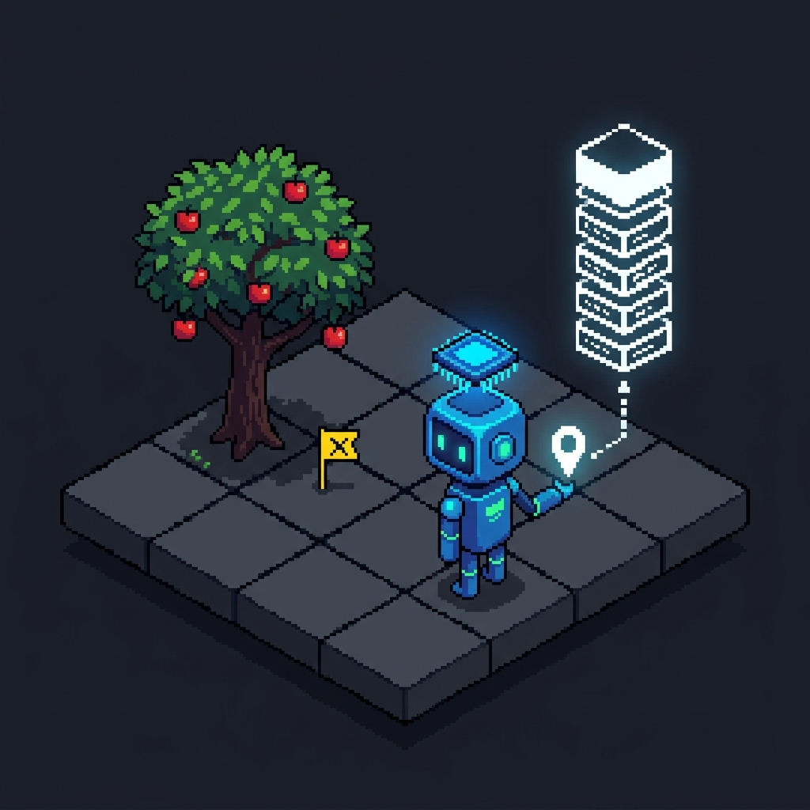
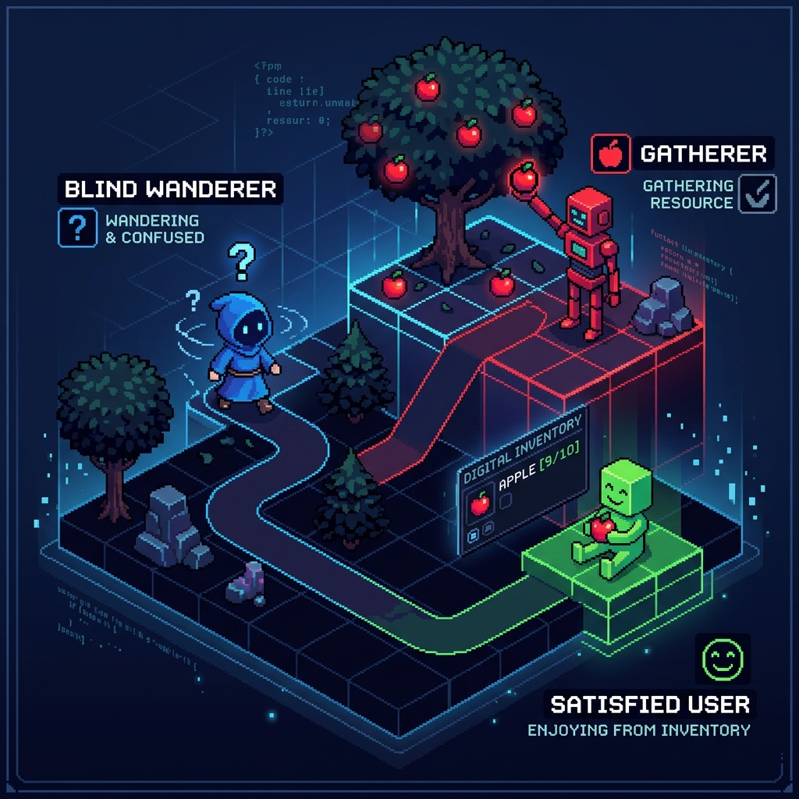
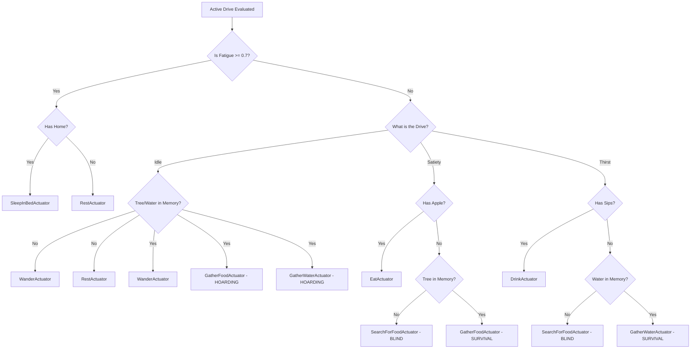
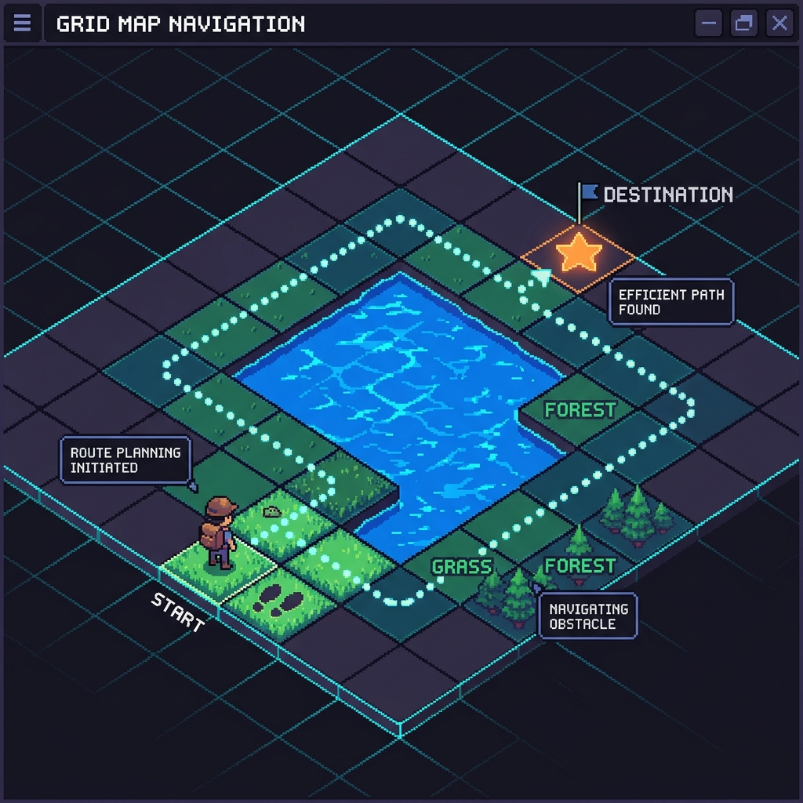
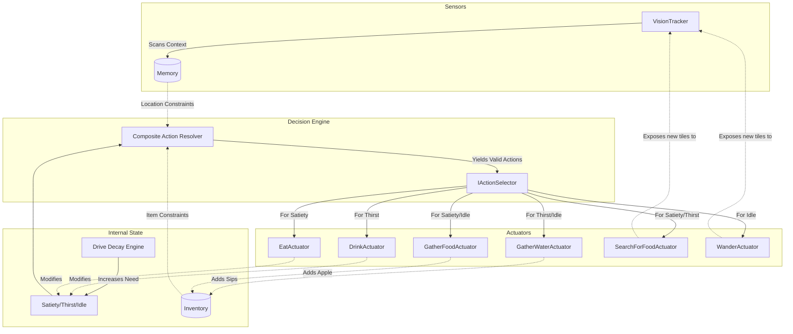
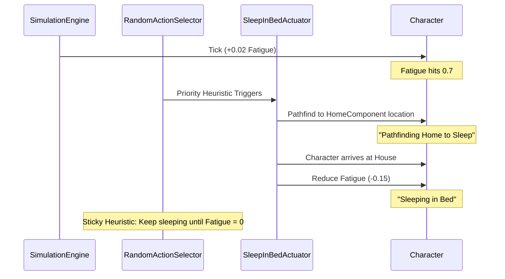
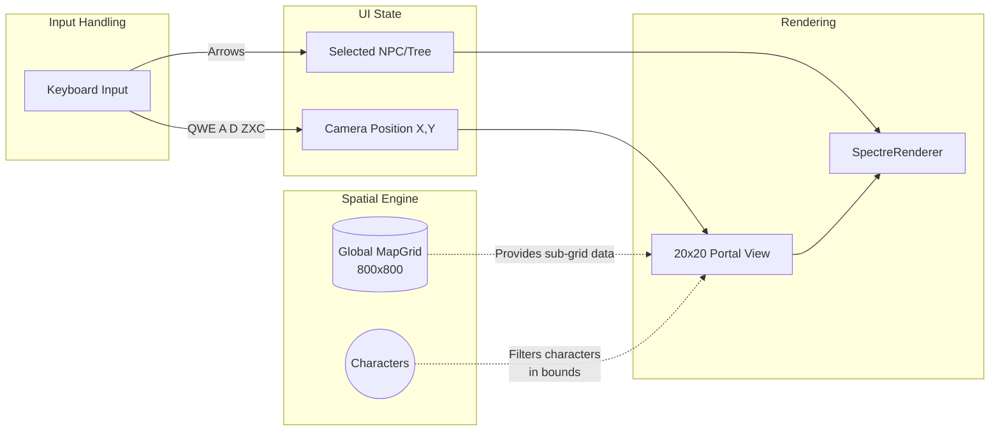
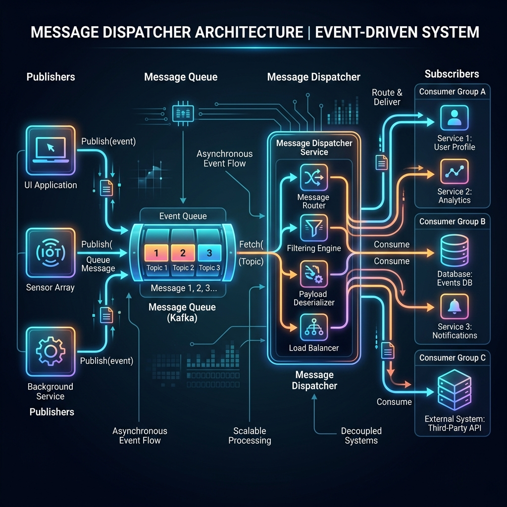
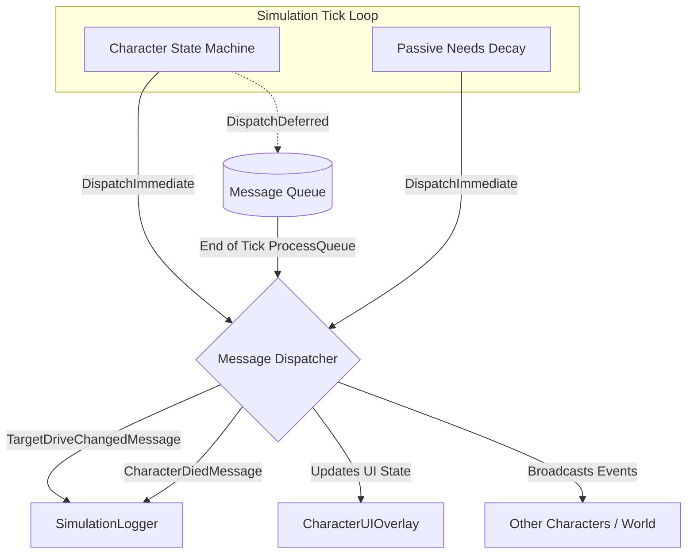

# NPC System Architecture

## Table of Contents
1. [Overview](#1-overview)
2. [Character Model & Drives](#2-character-model-drives)
3. [Memory & ECS Component Architecture](#3-memory-ecs-component-architecture)
4. [State Machine & Decision Logic](#4-state-machine-decision-logic)
5. [Spatial Context & Pathfinding](#5-spatial-context-pathfinding)
6. [Test Scenario: Survival of the Fittest](#6-test-scenario-survival-of-the-fittest)
7. [Housing & Sleep Cycle](#7-housing--sleep-cycle)
8. [UI & Rendering Architecture](#8-ui--rendering-architecture)
9. [Message Dispatcher Architecture](#9-message-dispatcher-architecture)

---

## 1. Overview

### Purpose
NPC is a C# library for **automated NPC characters**: simulated agents whose behavior is driven by internal state (innate drives, and eventually state machines) rather than scripted paths alone. The aim is **relatively simple application code** with room for **emergent behavior** as drives interact with the world and with each other over time.

### Namespace layout

Code lives under `NPC.Library.*`. Subfolders mirror domains:

| Folder | Namespace | Role |
|--------|-----------|------|
| `Character/` | `NPC.Library.Character` | What defines and holds one NPC’s runtime state |
| `Memory/` | `NPC.Library.Memory` | ECS-lite component architecture for sensory data |
| `Spatial/` | `NPC.Library.Spatial` | Map-agnostic pathfinding and positioning |
| `Simulation/` | `NPC.Library.Simulation` | High-level loops, vision tracking, and simulation engine |
| `State/` | `NPC.Library.State` | Action resolvers, state machines, and actuators |

All systems and services should be registered and wired up via **Dependency Injection** (`Microsoft.Extensions.DependencyInjection`).

---

## 2. Character Model & Drives

### Character
`Character` is the **runtime aggregate** for one NPC. It currently exposes its innate drive levels (`Drives`). Do not construct `Character` directly. Use `CharacterFactory`.

### Drive semantics
Most drives are **pressures** (higher = stronger urge). One drive is a **reserve**:

| Kind | Drives | High value means |
|------|--------|------------------|
| Reserve | `Satiety` | Well fueled — plenty of energy available to spend |
| Pressure | `Thirst`, `Fatigue`, `Idle` | Stronger need or wear |

### Satiety vs Fatigue
These are intentionally separate:
- **Satiety**: Metabolic fuel — how satisfied/fueled the body is (eating/rest restores it).
- **Fatigue**: Exertion wear — tired because you have **been doing too much**.

---

## 3. Memory & ECS Component Architecture

To support highly modular data payloads (like Memory, Afflictions, or Inventory) without bloating the core `Character` class, we use a lightweight Entity-Component System (ECS) pattern.



### The Component System
The `Character` class acts as an Entity and contains a generic Dictionary of components:
```csharp
char1.AddComponent<IMemory>(new GoldfishMemory());
var hasMemory = char1.TryGetComponent<IMemory>(out var memory);
```

### The `IMemory` Interface
The `IMemory` interface is designed to be **Machine Learning Ready**. It provides standard `Remember` and `Recall` methods, but also forces implementations to expose their internal configuration via `GetTunableParameters()` and `SetTunableParameters()`.

- **`SpatialMemory`**: Remembers all observed locations infinitely.
- **`GoldfishMemory`**: Acts as a queue. It forgets the oldest observations once it exceeds its tunable capacity.

### Vision Tracker (Sensory Input)
Memory is populated passively using the Event Listener pattern. The `VisionTracker` subscribes to the `StateMachine.OnActuatorExecuted` event. Every time a character completes an action, the `VisionTracker` scans the `ISpatialContext` and injects new points of interest (like an `AppleTree`) into the character's memory.

---

## 4. State Machine & Decision Logic

The state machine manages the high-level decision-making for NPCs based on their innate drives (needs) using an actuator-based architecture.

### Architecture

The system decouples "needs" from "actions" using three core concepts:
- **`IActuator`**: Represents a discrete action the character can take (e.g., eating, wandering). Execution is asynchronous.
- **`IActionResolver`**: Responsible for querying available actuators across the system for a given drive. We use a **`CompositeActionResolver`** to stitch multiple actuator groups together (like the `SurvivalActuatorGroup`).
- **`IActionSelector`**: Selects a single action from a list of available actuators. Designed to eventually be replaced by a Neural Network.



### The Decision Tree



### Memory 'Forgetting' Mechanics
When `GatherFoodActuator` successfully reaches an `AppleTree`, but finds that it has `0` apples left, the `VisionTracker` (which subscribes to completed actions) automatically observes that the tree is depleted and calls `memory.Forget()`. This causes the character to instantly forget the tree exists, preventing endless soft-locks of trying to gather from an empty tree. If the tree regrows later and the character randomly wanders past it, their `VisionTracker` will re-add it to their memory!

### Heuristics & Random Stochasticity
It is incredibly important to note that the **Decision Tree** above is slightly simplified. Because the `IActionSelector` is designed as an entry point for Neural Networks, the current default implementation (`RandomActionSelector`) is fundamentally **stochastic** (random). 

When the `CompositeActionResolver` yields multiple valid actions (for instance, if the character is `Idle`, it might yield *both* `WanderActuator` and `GatherFoodActuator`), the selector does **not** deterministically pick `GatherFood` just because a tree is in memory. It applies minor temporary heuristics (e.g. "always Eat if holding an Apple and hungry"), but if no heuristic strictly applies, it picks a random action from the yielded list!

This means characters might sometimes choose to blindly `Wander` even when they have a tree in memory, simulating free will or sub-optimal decision making until the true Neural Network takes over.

---

## 5. Spatial Context & Pathfinding

The simulation handles physical interactions and movement through a decoupled `ISpatialContext`. This ensures the core AI logic (Actuators, State Machines) never relies on a specific engine implementation.



### Concrete Implementations
- **`GridSpatialContext`**: The default implementation. It wraps a 2D `MapGrid` and tracks character positions using a dictionary.
- **`AStarPathfinder`**: The default pathfinder used by `GridSpatialContext`. It utilizes the A* algorithm (favoring Manhattan Distance) to route around impassable terrain like `TileType.Water`.

When an actuator needs to move a character, it queries the context for a path and issues a `MoveCharacter` command on each tick.

---

## 6. Test Scenario: Survival of the Fittest

In this test scenario, the characters are stripped of all non-essential drives. They possess only three core drives: **Satiety**, **Thirst**, and **Idle**.

They spawn with an empty `WaterBottleItem` in their inventory. Over time, their Satiety and Thirst will decay. If either value drops to `0`, the character enters an `IsDead = true` state and is permanently removed from the simulation loop. 

To survive, they must interact with the world to gather food and water using their Actuators, guided by their Sensors and Drives.

### Driver -> Sensor -> Actuator Pipeline



### Lethality
If the character fails to pathfind to an Apple Tree or Water tile in time (due to bad random wandering or poor Neural Network choices), their internal drive hits 0 and `IsDead` is flipped to true. The UI will instantly mark them as `DEAD`.

---

## 7. Housing & Sleep Cycle

To give characters a sense of permanence and realistic behavior, they are bound to a specific `TileType.House` via their `HomeComponent`.

### Sleep Actuator Flow



---

## 8. UI & Rendering Architecture

To prevent terminal buffer overflows and support massive simulation worlds, the UI layer operates independently from the spatial engine. The simulation map is massive (`800x800`), but the console renderer utilizes a sliding **Camera Viewport** pattern to only process and render a fixed `20x20` portal into the world at any given time.



### Camera Controls
The camera supports precise panning using the 8 keys surrounding `S` on a QWERTY keyboard. 
- **Lowercase** inputs pan the camera by 1 tile.
- **Uppercase** (Shift + Key) inputs pan the camera by 10 tiles.

| Key | Direction | Key | Direction | Key | Direction |
|-----|-----------|-----|-----------|-----|-----------|
| `Q` | Up-Left   | `W` | Up        | `E` | Up-Right  |
| `A` | Left      | `S` | (Center)  | `D` | Right     |
| `Z` | Down-Left | `X` | Down      | `C` | Down-Right|

---

## 9. Message Dispatcher Architecture



The simulation engine utilizes a decoupled Pub/Sub **Message Dispatcher** architecture instead of tightly-coupled native C# events (`event EventHandler`). This lays the groundwork for complex interactions where entities can broadcast and react to events without holding direct references to each other.

### Core Components

#### `MessageDispatcher`
A singleton service in `NPC.Library.Messaging` that handles routing strongly-typed messages to subscribers.
It supports two modes of execution:

1. **`DispatchImmediate(IMessage)`**: Fires the message to all listeners synchronously. Useful for purely reactive, non-state-mutating systems like logging or UI overlay updates.
2. **`DispatchDeferred(IMessage)`**: Enqueues the message to be processed at the very end of the simulation tick (`ProcessQueue`). This is crucial for avoiding race conditions, such as modifying a list of characters while the FSM is currently iterating over them.

### Architectural Diagram



### Strong-Typed Messages
We use `IMessage` and concrete implementations such as:
- `TargetDriveChangedMessage`
- `CharacterDiedMessage`
