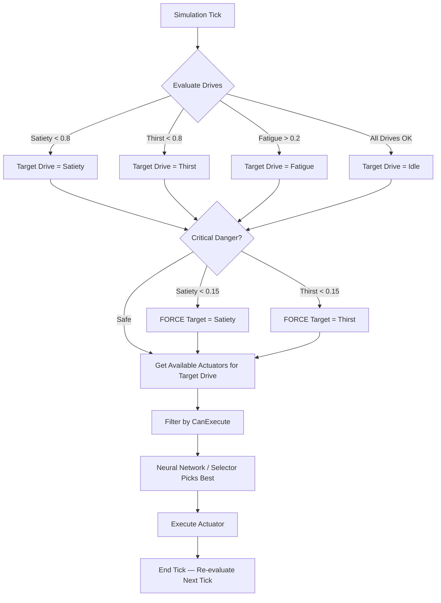
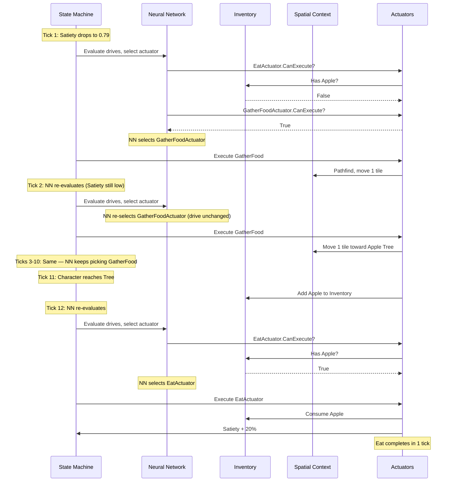

# NPC Architecture: Drives and Actuators

This document explains the current state of how character Needs (Drives) translate into Actions (Actuators), and how the State Machine manages these transitions.

---

## 1. Core Concepts

### Drives (The "Needs")
Drives represent the biological and psychological state of the character. They are evaluated on a scale of `0.0` to `1.0`.

> [!NOTE] 
> **Satiety and Thirst** operate as "Reserves". A high value (1.0) is good (full), and a low value (0.0) means starvation or dehydration. 
> **Fatigue**, however, operates as "Pressure". A high value (1.0) means extreme exhaustion, while a low value (0.0) means fully rested.

### Actuators (The "Actions")
Actuators are the actual behaviors a character can perform (e.g., `EatActuator`, `WanderActuator`). They dictate:
1. **Conditions:** Whether the character can currently perform the action (`CanExecute`).
2. **Behavior:** The logic of what happens when the action runs (`ExecuteAsync`).
3. **Re-evaluation:** Every tick, the NN re-evaluates and selects the best actuator fresh. Multi-step actuators are naturally re-selected while the drive persists.

---

## 2. The Decision Loop (State Machine)

Every simulation tick, the State Machine evaluates the character's Drives, chooses a Target Drive, and executes an Actuator to satisfy it.

---

## 3. Actuator Execution Model (One-Shot)

All actuators are now one-shot (`IsPersistent = false` by default). The Neural Network re-evaluates every tick and selects the best actuator fresh — no lock-in occurs.

### How It Works
* **Instant actions** like `EatActuator` (+20% satiety) and `DrinkActuator` (+33% thirst) complete in a single tick.
* **Multi-step actions** like `GatherFoodActuator` and `GatherWaterActuator` move one tile per tick. They are **re-selected each tick** by the NN because the underlying drive inputs (e.g. low Satiety) haven't changed. No persistence flag is needed.
* **Interruption is automatic**: if a higher-priority drive spikes mid-pathfind, the NN simply picks a different actuator next tick.

> [!NOTE]
> **Historical context**: `IsPersistent` was originally designed for slow incremental actions (eating/drinking over many ticks). The old default of `true` caused NPCs to get locked into actuators like `SearchForFoodActuator` for hundreds of ticks, preventing drive re-evaluation and leading to starvation deaths. As of 2026-05-27, the default is `false` and no actuator overrides it.

---

## 4. Drive Resolution Flow

Here is a practical example of how a hungry character resolves their need for food, step-by-step:

